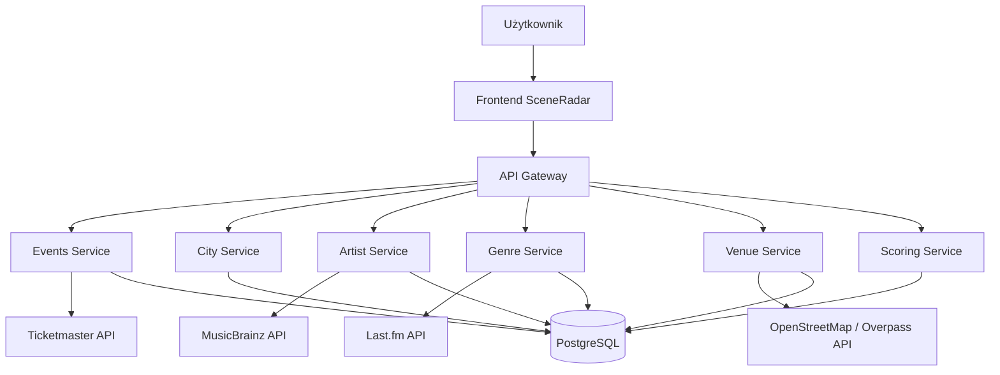
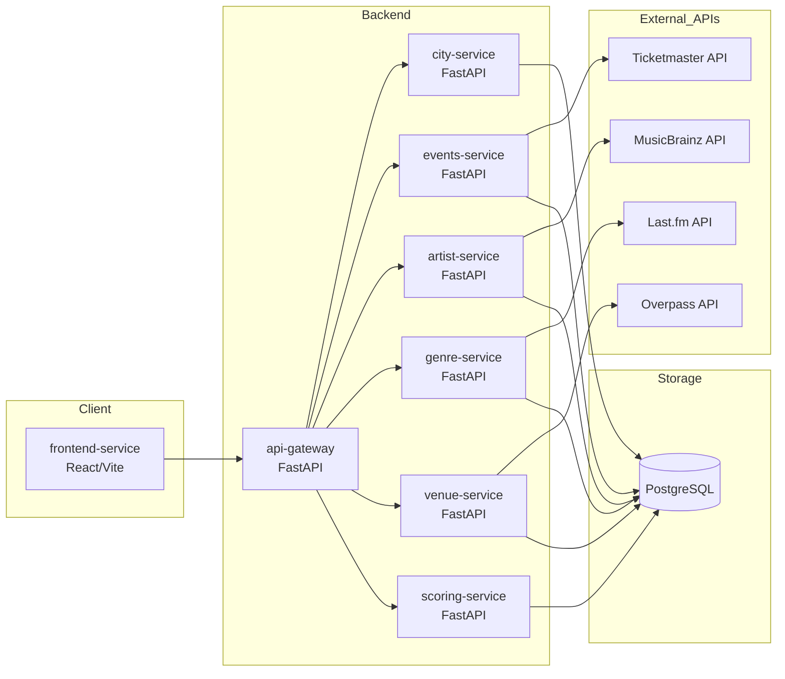
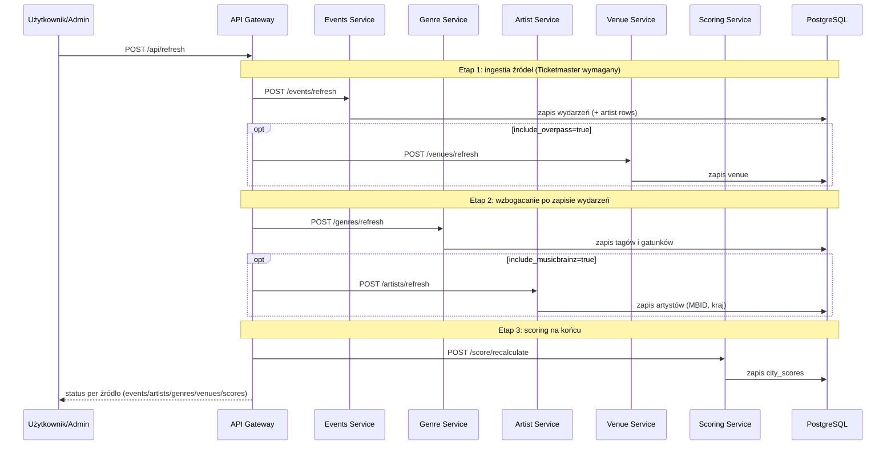
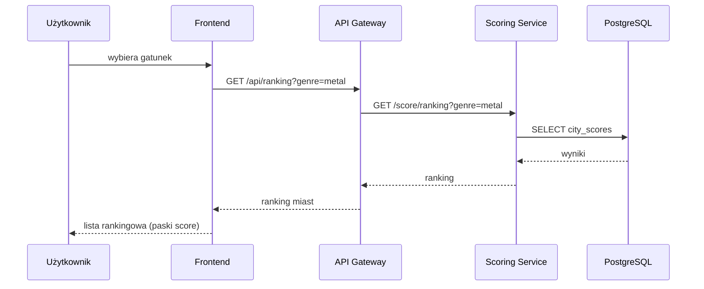

# SceneRadar, czyli mapa lokalnej sceny muzycznej

## Uruchomienie


**1. Zmienne środowiskowe**

Uzupełnij w `.env` klucze API: TICKETMASTER_API_KEY, LASTFM_API_KEY i MUSICBRAINZ_CONTACT_EMAIL


**2. Budowa i uruchomienie**

```bash
make up
```

Po starcie:

| Element | URL |
|---|---|
| Frontend | http://localhost:3000 |
| API Gateway | http://localhost:8000 |
| Swagger (OpenAPI) | http://localhost:8000/docs |
| Health gatewaya | http://localhost:8000/api/health |

**3. Zaciągnięcie realnych danych**

Baza startuje pusta (poza listą miast). Uruchom pipeline ingestii przez gateway:

```bash
curl -X POST http://localhost:8000/api/refresh
```

Etapowo: `/api/refresh/events`, `/api/refresh/artists`, `/api/refresh/genres`, `/api/refresh/venues`, `/api/refresh/scores`. Następnie otwórz http://localhost:3000 i wybierz gatunek, aby zobaczyć ranking miast.

**Pozostałe komendy**

```bash
make logs   # podgląd logów
make test   # testy jednostkowe w kontenerze
make down   # zatrzymanie i usunięcie wolumenów
```

Tryb developerski: `docker compose -f docker-compose.yml -f docker-compose.dev.yml up --build`. Pełna instrukcja: [sekcja 18](#18-instrukcja-uruchomienia).

---

## 1. Opis projektu

**SceneRadar** to aplikacja webowa analizująca lokalne sceny muzyczne w wybranych miastach. System pobiera dane o koncertach, artystach, gatunkach muzycznych, popularności wykonawców oraz miejscach koncertowych, a następnie wylicza SceneRadar Score, czyli ocenę sceny muzycznej danego miasta dla wybranego gatunku.


Aplikacja łączy dane z kilku źródeł, zapisuje je w bazie danych i udostępnia przez API oraz przez rankingi i linki na stronie.

---

## 2. Główne funkcjonalności systemu

### 2.1. Ranking miast według gatunku muzycznego

Użytkownik wybiera gatunek muzyczny, na przykład metal lub techno.
System zwraca ranking miast:

```text
Gatunek: metal

1. Warszawa — 91/100
2. Kraków — 84/100
3. Wrocław — 78/100
4. Gdańsk — 72/100
5. Poznań — 70/100
```

### 2.2. Szczegóły miasta

Dla wybranego miasta aplikacja pokazuje:

- liczbę wydarzeń muzycznych,
- najczęstsze gatunki,
- najbliższe koncerty,
- najpopularniejszych artystów,
- listę klubów i sal koncertowych (venue) z linkami do Google Maps,
- końcowy SceneRadar Score,
- składowe wyniku.

### 2.3. Lista venue lokalnej sceny muzycznej

Frontend prezentuje listę venues, czyli miejsc wydarzeń (klubów, sal koncertowych, teatrów,
barów z muzyką na żywo, większych obiektów eventowych). Każde venue ma typ,
adres oraz link otwierający lokalizację w Google Maps.


### 2.4. Odświeżanie danych

Administrator lub użytkownik techniczny może wywołać odświeżenie danych:

```http
POST /api/refresh
```

System uruchamia pobieranie danych z zewnętrznych API, aktualizuje bazę i przelicza wyniki.

---

## 3. Źródła danych i API

### 3.1. Ticketmaster Discovery API

Źródła danych o wydarzeniach muzycznych, datach, miastach, venues, kategori. Dostarcza dane dla `events-service`.

Przykładowe dane pobierane z API:

```text
event_id
event_name
event_date
event_url
city
venue_name
latitude
longitude
classification
genre
subgenre
artist_name
```


---

### 3.2. Last.fm API

Źródło danych o tagach gatunkowych, popularności artystów, podobnych artystach. Uzupełnienie brakujących gatunków z Ticketmaster i dostarcza dane dla `genre-service`.

Przykładowe dane:

```text
artist_name
top_tags
listeners
playcount
similar_artists
```


---

### 3.3. MusicBrainz API

Służy do identyfikowania artystów i ujednolicania danych z różnych źródeł. Rozwiązuje problem różnych zapisów nazw artystów, przechowuje stabilny identyfikator MBID i dostarcza dane dla `artist-service`.

Przykładowe dane:

```text
mbid
artist_name
country
type
life_span
aliases
disambiguation
```

---

### 3.4. OpenStreetMap / Overpass API

Źródło danych mapowych o venue i infrastrukturze muzycznej miasta. Liczy gęstość venue w mieście, buduje mapy lokalnych scen muzycznych i wspiera 'venue-service'.

Przykładowe obiekty:

```text
club
music_venue
theatre
bar
arts_centre
concert_hall
nightclub
```

Przykładowe dane:

```text
venue_name
venue_type
latitude
longitude
address
city
osm_id
```
---

## 4. Architektura systemu

Projekt wykorzystuje lekką architekturę mikroserwisową. Każdy serwis odpowiada za jeden konkretny obszar systemu. Dzięki temu system ma czytelny podział odpowiedzialności.

### 4.1. Warstwy systemu

System składa się z następujących warstw:

1. **Warstwa źródeł danych**
   - Ticketmaster API,
   - Last.fm API,
   - MusicBrainz API,
   - OpenStreetMap/Overpass API.

2. **Warstwa akwizycji danych**
   - serwisy pobierające dane z API zewnętrznych,
   - obsługa kluczy API,
   - obsługa błędów i limitów zapytań.

3. **Warstwa przetwarzania danych**
   - parsowanie odpowiedzi JSON/XML,
   - normalizacja nazw artystów,
   - mapowanie gatunków,
   - deduplikacja wydarzeń,
   - obliczanie wskaźników.

4. **Warstwa bazy danych**
   - PostgreSQL,
   - tabele domenowe,
   - logi pobierania danych,
   - wyniki scoringu.

5. **Warstwa backend API**
   - API Gateway,
   - endpointy REST,
   - Swagger/OpenAPI.

6. **Warstwa frontend**
   - aplikacja webowa,
   - ranking,
   - szczegóły miasta,
   - lista wydarzeń i venue (z linkami do Google Maps),
   - wskaźniki składowych score (paski postępu).

7. **Warstwa uruchomieniowa**
   - Docker,
   - Docker Compose,
   - osobne konfiguracje dev/test/prod.

---

## 5. Diagram kontekstowy C4



---

## 6. Diagram kontenerów



---

## 7. Mikroserwisy

## 7.1. `frontend-service`

### Odpowiedzialność

Serwis frontendowy odpowiada za prezentację danych użytkownikowi.

### Technologia

```text
React + Vite (lucide-react do ikon)
```

### Funkcje

- wybór gatunku,
- ranking miast,
- szczegóły miasta (wydarzenia, venue, score),
- przycisk odświeżania danych.

### Struktura widoku

Frontend to **jednostronicowy dashboard** (`src/App.jsx`), bez routingu (brak `react-router`).
Cała nawigacja odbywa się przez stan komponentu. Wybór gatunku i miasta przeładowuje
dane przez API Gateway (`VITE_API_URL`, domyślnie `http://localhost:8000`).

---

## 7.2. `api-gateway`

### Odpowiedzialność

Główne API aplikacyjne, z którym komunikuje się frontend. Jego zadaniem jest zebranie danych z mikroserwisów i wystawienie spójnych endpointów dla frontendu. Wykorzystuje technologię FastAPI.

### Funkcje

- agregacja danych z mikroserwisów,
- wystawianie REST API dla frontendu,
- walidacja parametrów zapytań,
- obsługa błędów,
- dokumentacja Swagger/OpenAPI,
- endpoint health check.

### Endpointy

```http
GET  /api/health
GET  /api/cities
GET  /api/genres
GET  /api/ranking?genre=metal&date_from=2026-06-01&date_to=2026-06-30
GET  /api/cities/{city_id}
GET  /api/cities/{city_id}/events?genre=metal
GET  /api/cities/{city_id}/venues
GET  /api/cities/{city_id}/score?genre=metal
GET  /api/dashboard/{city_id}?genre=metal
GET  /api/ingestion-logs?limit=30
POST /api/refresh
POST /api/refresh/events
POST /api/refresh/venues
POST /api/refresh/genres
POST /api/refresh/artists
POST /api/refresh/scores
```

`/api/refresh` uruchamia równoległe odświeżenie wszystkich źródeł i zwraca
wynik po jego zakończeniu. Wolne źródła (Overpass, MusicBrainz) są domyślnie pomijane,
można je włączyć parametrami `?include_overpass=true` i `?include_musicbrainz=true`,
albo uruchomić osobno przez endpointy `/api/refresh/{venues,artists}`.

### Przykładowa odpowiedź `/api/ranking`

```json
[
  {
    "city_id": 1,
    "city_name": "Warszawa",
    "genre": "metal",
    "final_score": 91.4,
    "event_score": 88.0,
    "venue_score": 94.0,
    "artist_popularity_score": 90.0,
    "genre_diversity_score": 85.0,
    "summary": "Warszawa ma bardzo dużą liczbę wydarzeń metalowych, wysoką dostępność venue i wielu popularnych artystów w nadchodzących koncertach."
  }
]
```

---

## 7.3. `city-service`

City-service przechowuje i udostępnia dane o miastach analizowanych przez system.

### Dane

```text
city_id
name
country
region
latitude
longitude
population_optional
created_at
updated_at
```

### Funkcje

Ten serwis inicjalizuje liczbę miast, udostępnia ich współrzędne, mapuje nazwy na identyfikatory i przechowuje dane statystyczne.

### Endpointy

```http
GET  /health
GET  /cities
GET  /cities/{city_id}
POST /cities
```

### Lista miast

```text
Warszawa
Kraków
Wrocław
Gdańsk
Poznań
Łódź
Katowice
Lublin
```

---

## 7.4. `events-service`


Event-service pobiera dane z Ticketmaster Discovery API o wydarzeniach muzycznych, a następnie je przetwarza.


### Funkcje

- pobieranie wydarzeń po mieście i dacie,
- filtrowanie wydarzeń muzycznych,
- normalizacja nazw wydarzeń,
- deduplikacja wydarzeń,
- mapowanie wydarzeń do miasta,
- zapis do tabeli `events`,
- zapis logów do `ingestion_logs`.

### Endpointy

```http
GET  /events/health
POST /events/refresh
GET  /events?city_id=1&genre=metal&date_from=2026-06-01&date_to=2026-06-30
```

### Dane zapisywane do bazy

```text
external_id
name
city_id
venue_id
event_date
event_time
category
genre_raw
subgenre_raw
artist_name_raw
source
url
latitude
longitude
created_at
updated_at
```

### Reguły przetwarzania

1. Jeżeli wydarzenie nie ma kategorii muzycznej, zostaje pominięte.
2. Jeżeli wydarzenie ma taki sam `external_id`, jest aktualizowane, a nie dodawane ponownie.
3. Jeżeli brakuje venue, wydarzenie zostaje zapisane z `venue_id = NULL`.
4. Jeżeli brakuje artysty, artysta jest później uzupełniany przez `artist-service`.

---

## 7.5. `artist-service`

Artist-service identyfikuje artystów i ujednolica ich dane między źródłami na podstawie MusicBrainz API.


### Funkcje

- wyszukiwanie artysty po nazwie,
- pobieranie MBID,
- pobieranie kraju pochodzenia artysty,
- obsługa aliasów,
- rozwiązywanie konfliktów nazw,
- zapis do tabeli `artists`.

### Endpointy

```http
GET  /artists/health
GET  /artists?name=Metallica
GET  /artists/{artist_id}
POST /artists/resolve
POST /artists/refresh
```


### Dane zapisywane do bazy

```text
id
mbid
name
sort_name
country
artist_type
disambiguation
created_at
updated_at
```

---

## 7.6. `genre-service`

Genre-service klasyfikuje artystów i wydarzenia do gatunków muzycznych na podstawie danych z Last.fm API.

### Funkcje

- pobieranie tagów artysty,
- mapowanie tagów na główne gatunki,
- ocena popularności artysty,
- zapis tagów do bazy,
- uzupełnianie danych wydarzeń o gatunek.

### Endpointy

```http
GET  /genres/health
GET  /genres
GET  /genres/artists
POST /genres/classify-artist
POST /genres/refresh
```

### Przykład mapowania tagów

| Tag z Last.fm | Gatunek główny |
|---|---|
| heavy metal | metal |
| thrash metal | metal |
| black metal | metal |
| techno | techno |
| minimal techno | techno |
| hip-hop | rap |
| polish hip-hop | rap |
| jazz fusion | jazz |
| indie rock | indie |

### Dane zapisywane do bazy

```text
artist_id
tag_name
tag_weight
main_genre
source
created_at
```

### Uwagi

Tagi z Last.fm mogą być niejednoznaczne, dlatego system przechowuje zarówno surowe tagi, jak i gatunek główny po mapowaniu.

---

## 7.7. `venue-service`

Venue-service pobiera i przetwarza dane o miejscach koncertowych i klubach na podstawie OpenStreetMap / Overpass API.


### Funkcje

- pobieranie venue dla miasta,
- filtrowanie obiektów związanych z muzyką,
- zapisywanie współrzędnych,
- oznaczanie typu venue,
- wyliczanie gęstości venue,
- dostarczanie danych venue (z współrzędnymi) do frontendu.

### Endpointy

```http
GET  /venues/health
GET  /venues?city_id=1
GET  /venues/density?city_id=1
POST /venues/refresh
```

### Typy venue

```text
club
nightclub
music_venue
concert_hall
theatre
bar
arts_centre
stadium
arena
```

### Dane zapisywane do bazy

```text
id
osm_id
name
city_id
venue_type
latitude
longitude
address
source
created_at
updated_at
```

---

## 7.8. `scoring-service`

Scoring-service liczy końcowy wynik miasta dla wybranego gatunku muzycznego.

### Funkcje

- liczenie `event_score`,
- liczenie `venue_score`,
- liczenie `artist_popularity_score`,
- liczenie `genre_diversity_score`,
- liczenie `final_score`,
- zapisywanie wyników do tabeli `city_scores`,
- generowanie krótkiego tekstowego uzasadnienia wyniku.

### Endpointy

```http
GET /score/health
POST /score/recalculate
GET /score?city_id=1&genre=metal
GET /score/ranking?genre=metal
```

### Wzór SceneRadar Score

SceneRadar Score = 0.40 * event_score + 0.25 * venue_score + 0.20 * artist_popularity_score + 0.15 * genre_diversity_score

### Składniki wyniku

Składowe liczone są liniowo i przycinane do zakresu 0–100 (zob. `services/_shared/scoring.py`).

#### `event_score`

Ocena liczby wydarzeń muzycznych w danym gatunku. Pełny wynik (100 pkt) przy 12 wydarzeniach: event_score = clamp((liczba_wydarzeń / 12) * 100, 0, 100)


#### `venue_score`

Ocena liczby miejsc koncertowych w mieście. Pełny wynik (100 pkt) przy 15 venue: venue_score = clamp((liczba_venue / 15) * 100, 0, 100)


#### `artist_popularity_score`

Średnia znormalizowana popularność artystów występujących w danym mieście, liczona na
podstawie danych z Last.fm.

#### `genre_diversity_score`

Ocena różnorodności sceny mierzona liczbą unikalnych podgatunków. Pełny wynik (100 pkt)
przy 5 różnych podgatunkach: genre_diversity_score = clamp((liczba_unikalnych_podgatunków / 5) * 100, 0, 100)

Przykładowe podgatunki dla metalu: heavy metal, thrash metal, black metal, death metal,
progressive metal. Im więcej różnych podgatunków, tym wyższa ocena.

---

## 8. Przepływ danych

### 8.1. Odświeżanie danych



### 8.2. Pobranie rankingu



---

## 9. Projekt bazy danych

### 9.1. Tabela `cities`

```sql
CREATE TABLE cities (
    id SERIAL PRIMARY KEY,
    name VARCHAR(100) NOT NULL,
    country VARCHAR(100) NOT NULL DEFAULT 'Poland',
    region VARCHAR(100),
    latitude NUMERIC(9, 6),
    longitude NUMERIC(9, 6),
    created_at TIMESTAMP DEFAULT CURRENT_TIMESTAMP,
    updated_at TIMESTAMP DEFAULT CURRENT_TIMESTAMP
);
```

### 9.2. Tabela `venues`

```sql
CREATE TABLE venues (
    id SERIAL PRIMARY KEY,
    osm_id VARCHAR(100),
    city_id INTEGER REFERENCES cities(id),
    name VARCHAR(255),
    venue_type VARCHAR(100),
    latitude NUMERIC(9, 6),
    longitude NUMERIC(9, 6),
    address TEXT,
    source VARCHAR(100) DEFAULT 'OpenStreetMap',
    created_at TIMESTAMP DEFAULT CURRENT_TIMESTAMP,
    updated_at TIMESTAMP DEFAULT CURRENT_TIMESTAMP
);
```

### 9.3. Tabela `artists`

```sql
CREATE TABLE artists (
    id SERIAL PRIMARY KEY,
    mbid VARCHAR(100),
    name VARCHAR(255) NOT NULL,
    sort_name VARCHAR(255),
    country VARCHAR(100),
    artist_type VARCHAR(100),
    disambiguation TEXT,
    created_at TIMESTAMP DEFAULT CURRENT_TIMESTAMP,
    updated_at TIMESTAMP DEFAULT CURRENT_TIMESTAMP
);
```

### 9.4. Tabela `events`

```sql
CREATE TABLE events (
    id SERIAL PRIMARY KEY,
    external_id VARCHAR(255),
    name VARCHAR(255) NOT NULL,
    city_id INTEGER REFERENCES cities(id),
    venue_id INTEGER REFERENCES venues(id),
    artist_id INTEGER REFERENCES artists(id),
    event_date DATE,
    event_time TIME,
    category VARCHAR(100),
    genre_raw VARCHAR(100),
    subgenre_raw VARCHAR(100),
    artist_name_raw VARCHAR(255),
    source VARCHAR(100),
    url TEXT,
    latitude NUMERIC(9, 6),
    longitude NUMERIC(9, 6),
    created_at TIMESTAMP DEFAULT CURRENT_TIMESTAMP,
    updated_at TIMESTAMP DEFAULT CURRENT_TIMESTAMP,
    UNIQUE(external_id, source)
);
```

### 9.5. Tabela `artist_tags`

```sql
CREATE TABLE artist_tags (
    id SERIAL PRIMARY KEY,
    artist_id INTEGER REFERENCES artists(id),
    tag_name VARCHAR(100),
    tag_weight NUMERIC(6, 2),
    main_genre VARCHAR(100),
    source VARCHAR(100) DEFAULT 'Last.fm',
    created_at TIMESTAMP DEFAULT CURRENT_TIMESTAMP
);
```

### 9.6. Tabela `city_scores`

```sql
CREATE TABLE city_scores (
    id SERIAL PRIMARY KEY,
    city_id INTEGER REFERENCES cities(id),
    genre VARCHAR(100),
    date_from DATE,
    date_to DATE,
    event_score NUMERIC(5, 2),
    venue_score NUMERIC(5, 2),
    artist_popularity_score NUMERIC(5, 2),
    genre_diversity_score NUMERIC(5, 2),
    final_score NUMERIC(5, 2),
    summary TEXT,
    created_at TIMESTAMP DEFAULT CURRENT_TIMESTAMP
);
```

### 9.7. Tabela `ingestion_logs`

```sql
CREATE TABLE ingestion_logs (
    id SERIAL PRIMARY KEY,
    service_name VARCHAR(100),
    source_name VARCHAR(100),
    status VARCHAR(50),
    records_fetched INTEGER,
    records_saved INTEGER,
    error_message TEXT,
    started_at TIMESTAMP,
    finished_at TIMESTAMP,
    duration_ms INTEGER
);
```

---

## 10. API Gateway

### 10.1. Health check

```http
GET /api/health
```

Przykładowa odpowiedź:

```json
{
  "status": "ok",
  "service": "api-gateway",
  "services": {
    "city": "http://city-service:8001",
    "events": "http://events-service:8002",
    "artist": "http://artist-service:8003",
    "genre": "http://genre-service:8004",
    "venue": "http://venue-service:8005",
    "scoring": "http://scoring-service:8006"
  }
}
```

### 10.2. Lista miast

```http
GET /api/cities
```

Przykładowa odpowiedź:

```json
[
  {
    "id": 1,
    "name": "Warszawa",
    "country": "Poland",
    "latitude": 52.2297,
    "longitude": 21.0122
  }
]
```

### 10.3. Lista gatunków

```http
GET /api/genres
```

Przykładowa odpowiedź:

```json
[
  "all",
  "metal",
  "rap",
  "jazz",
  "indie",
  "pop",
  "electronic",
  "techno"
]
```

### 10.4. Ranking miast

```http
GET /api/ranking?genre=metal&date_from=2026-06-01&date_to=2026-06-30
```

Przykładowa odpowiedź:

```json
[
  {
    "city_id": 1,
    "city_name": "Warszawa",
    "genre": "metal",
    "final_score": 91.4,
    "event_score": 88.0,
    "venue_score": 94.0,
    "artist_popularity_score": 90.0,
    "genre_diversity_score": 85.0,
    "summary": "Warszawa ma bardzo mocną scenę metalową: dużo wydarzeń, wiele venue i popularnych artystów."
  },
  {
    "city_id": 2,
    "city_name": "Kraków",
    "genre": "metal",
    "final_score": 84.2,
    "event_score": 78.0,
    "venue_score": 88.0,
    "artist_popularity_score": 82.0,
    "genre_diversity_score": 80.0,
    "summary": "Kraków ma aktywną scenę metalową i dobrą bazę venue."
  }
]
```

### 10.5. Szczegóły miasta

```http
GET /api/cities/{city_id}/score?genre=metal
```

### 10.6. Wydarzenia miasta

```http
GET /api/cities/{city_id}/events?genre=metal
```

### 10.7. Venue miasta

```http
GET /api/cities/{city_id}/venues
```

### 10.8. Odświeżenie danych

```http
POST /api/refresh
```

Odświeżanie jest synchroniczne i równoległe, odpowiedź zwracana jest dopiero po
zakończeniu pipeline'u i zawiera wynik per źródło. Wolne źródła (Overpass, MusicBrainz)
są domyślnie pomijane (`status: "skipped"`).

Przykładowa odpowiedź:

```json
{
  "status": "ok",
  "mode": "parallel-fast",
  "message": "Parallel refresh finished. Slow sources are optional; check per-service results below.",
  "events": { "status": "ok" },
  "artists": { "status": "skipped", "source": "MusicBrainz" },
  "genres": { "status": "ok" },
  "venues": { "status": "skipped", "source": "OpenStreetMap/Overpass" },
  "scores": { "status": "ok" }
}
```

Pełne odświeżenie wraz z wolnymi źródłami: `POST /api/refresh?include_overpass=true&include_musicbrainz=true`.

---

## 11. Obsługa błędów

### 11.1. Błędy zewnętrznego API

Jeżeli zewnętrzne API nie odpowiada:

1. Serwis zapisuje błąd w logach aplikacji.
2. Serwis zapisuje rekord w tabeli `ingestion_logs`.
3. Serwis zwraca kontrolowaną odpowiedź z kodem błędu.
4. System nie przerywa działania całej aplikacji.

Przykład odpowiedzi:

```json
{
  "status": "error",
  "source": "Ticketmaster",
  "message": "External API unavailable. Try again later."
}
```

### 11.2. Brak danych

Jeżeli dla miasta nie znaleziono wydarzeń:

```json
{
  "city": "Lublin",
  "genre": "techno",
  "final_score": 32.0,
  "summary": "Brak wielu wydarzeń w wybranym okresie. Wynik oparty głównie na liczbie venue."
}
```

### 11.3. Nieznany gatunek

```json
{
  "detail": "Unsupported genre. Available genres: metal, techno, rap, jazz, indie, pop, electronic."
}
```

---

## 12. Logowanie

Każdy mikroserwis powinien używać standardowego loggera.

Przykładowe logi:

```text
[events-service] Starting Ticketmaster ingestion for city=Warszawa
[events-service] Fetched 47 raw events
[events-service] Saved 43 events, skipped 4 duplicates
[events-service] Finished ingestion in 2300 ms
```

W tabeli `ingestion_logs` zapisywane są:

```text
service_name
source_name
status
records_fetched
records_saved
error_message
started_at
finished_at
duration_ms
```

---

## 13. Struktura repozytorium

```text
sceneradar_ticketmaster_stable/
│
├── .env.example
├── .gitignore
├── Makefile
├── pytest.ini
├── docker-compose.yml
├── docker-compose.dev.yml
├── docker-compose.test.yml
├── docker-compose.prod.yml
│
├── docs/
│   ├── README_architecture_reference.md
│   ├── architecture.md
│   ├── api.md
│   ├── testing.md
│   ├── deployment.md
│   └── examples/
│       └── request_examples.http
│
├── database/
│   └── init.sql
│
├── services/
│   ├── __init__.py
│   ├── requirements.txt
│   ├── _shared/            # wspólny kod db, config, http, genres, scoring, logging
│   ├── api_gateway/
│   ├── city_service/
│   ├── events_service/
│   ├── artist_service/
│   ├── genre_service/
│   ├── venue_service/
│   └── scoring_service/
│
├── frontend/
│
└── tests/
    ├── unit/
    └── performance/
```

---

## 14. Struktura pojedynczego mikroserwisu

Każdy serwis jest celowo lekki, cała logika (endpointy, klient zewnętrznego API,
przetwarzanie, zapis do bazy) znajduje się w jednym `app/main.py`, a kod współdzielony
między serwisami w `services/_shared/`.

```text
services/
│
├── events_service/
│   ├── __init__.py
│   ├── Dockerfile
│   └── app/
│       ├── __init__.py
│       └── main.py        # endpointy + klient Ticketmaster + zapis do bazy
│
├── _shared/
│   ├── db.py              # połączenie psycopg2 + helpery fetch/execute
│   ├── config.py          # zmienne środowiskowe (DB_CONFIG, klucze API)
│   ├── http.py            # konfiguracja CORS
│   ├── genres.py          # SUPPORTED_GENRES + mapowanie tagów na gatunki
│   ├── scoring.py         # wzory SceneRadar Score
│   └── logging_utils.py   # konfiguracja loggera
│
└── requirements.txt       # wspólne zależności dla wszystkich serwisów
```

### Rola elementów

| Element | Rola |
|---|---|
| `app/main.py` | Aplikacja FastAPI: endpointy, logika biznesowa, klient zewnętrznego API i zapis do bazy. |
| `Dockerfile` | Obraz serwisu (wspólny wzorzec: instalacja i kopiowanie `services/`). |
| `_shared/db.py` | Połączenie z PostgreSQL przez `psycopg2` i helpery `fetch_all`/`fetch_one`/`execute`. |
| `_shared/config.py` | Zmienne środowiskowe i konfiguracja (`DB_CONFIG`, klucze API). |
| `_shared/genres.py` | Lista obsługiwanych gatunków i mapowanie tagów Last.fm na gatunki główne. |
| `_shared/scoring.py` | Wzory składowych i końcowego SceneRadar Score. |

---

## 15. Docker i środowiska

### 15.1. Kontenery

Projekt uruchamia następujące kontenery:

```text
frontend
api-gateway
city-service
events-service
artist-service
genre-service
venue-service
scoring-service
postgres
```

---

### 15.2 Pliki Konfiguracji

Projekt wykorzystuje kilka konfiguracji Docker Compose:

| Plik                      | Przeznaczenie                                                                                        |
| ------------------------- | ---------------------------------------------------------------------------------------------------- |
| `docker-compose.yml`      | Domyślna konfiguracja uruchamiająca wszystkie mikroserwisy, bazę PostgreSQL oraz frontend.           |
| `docker-compose.dev.yml`  | Środowisko developerskie z hot reload, rozszerzonym logowaniem i wsparciem debugowania.              |
| `docker-compose.test.yml` | Środowisko testowe wykorzystywane do uruchamiania testów automatycznych oraz izolowanej bazy danych. |
| `docker-compose.prod.yml` | Konfiguracja produkcyjna/demo z zoptymalizowanymi obrazami i wyłączonymi funkcjami developerskimi.   |

Przykładowe uruchomienie:

```bash
docker compose -f docker-compose.dev.yml up --build
docker compose -f docker-compose.test.yml up
docker compose -f docker-compose.prod.yml up -d
```

---

## 16. Zmienne środowiskowe

Plik `.env.example`:

```env
# Database
POSTGRES_DB=sceneradar
POSTGRES_USER=sceneradar
POSTGRES_PASSWORD=sceneradar
POSTGRES_HOST=postgres
POSTGRES_PORT=5432

# Klucze API
TICKETMASTER_API_KEY=
LASTFM_API_KEY=

# MusicBrainz nie używa klucza, ale wymaga sensownego User-Agent/kontaktu
MUSICBRAINZ_APP_NAME=SceneRadarStudentProject
MUSICBRAINZ_CONTACT_EMAIL=

# Overpass / OpenStreetMap nie wymaga klucza
OVERPASS_URL=https://overpass-api.de/api/interpreter
```

Wewnętrzne adresy serwisów (`CITY_SERVICE_URL` … `SCORING_SERVICE_URL`) oraz adres gatewaya
dla przeglądarki (`VITE_API_URL=http://localhost:8000`) nie są wymienione w `.env.example`,
są ustawiane w `docker-compose.yml` i mają wartości domyślne w kodzie, więc nie
trzeba ich nadpisywać przy lokalnym uruchomieniu.

---

## 17. Testy

### 17.1. Testy jednostkowe

Testy jednostkowe (`tests/unit/`) obejmują logikę mapowania gatunków i scoringu:

```text
# tests/unit/test_genre_mapping.py
test_metal_tag_mapping
test_rap_tag_mapping
test_unknown_tag_returns_none

# tests/unit/test_scoring_logic.py
test_event_score_zero_events
test_event_score_many_events_is_capped
test_venue_score_scales_to_100
test_diversity_score
test_final_sceneradar_score
```

### 17.2. Przykład testu scoringu

```python
def test_final_sceneradar_score():
    event_score = 80
    venue_score = 70
    artist_popularity_score = 90
    genre_diversity_score = 60

    final_score = (
        0.40 * event_score
        + 0.25 * venue_score
        + 0.20 * artist_popularity_score
        + 0.15 * genre_diversity_score
    )

    assert final_score == 76.5
```

### 17.3. Testy wydajnościowe

Wykorzystują narzędzie Locust (`tests/performance/locustfile.py`). Klasa `SceneRadarUser`
odpytuje gateway z wagami zadań:

```text
@task(4)  GET /api/ranking?genre=metal
@task(2)  GET /api/cities
@task(2)  GET /api/cities/1/events?genre=metal
@task(1)  GET /api/dashboard/1?genre=metal
```

Uruchomienie (gateway musi działać na `http://localhost:8000`):

```bash
locust -f tests/performance/locustfile.py --host http://localhost:8000
```

### 17.4. Wyniki uruchomienia testów (2026-06-08)

Testy jednostkowe wywołane za pomocą `python -m pytest tests/unit`:

```text
8 passed in 0.01s
```

Wszystkie 8 testów (mapowanie gatunków + scoring) przeszło.

Test wydajnościowy 50 użytkowników, spawn rate 10/s,
czas trwania 60 s, uruchchamia się go za pomocą:

```bash
locust -f tests/performance/locustfile.py --host http://localhost:8000 \
  --headless -u 50 -r 10 -t 60s
```

| Endpoint | # req | Fails | Avg [ms] | Med [ms] | p95 [ms] | Max [ms] | req/s |
|---|---|---|---|---|---|---|---|
| `GET /api/ranking?genre=metal` | 622 | 0 | 24 | 19 | 43 | 172 | 10,39 |
| `GET /api/cities` | 342 | 0 | 23 | 18 | 39 | 173 | 5,71 |
| `GET /api/cities/1/events?genre=metal` | 312 | 0 | 31 | 25 | 69 | 180 | 5,21 |
| `GET /api/dashboard/1?genre=metal` | 167 | 0 | 127 | 110 | 200 | 270 | 2,79 |
| Aggregated | 1443 | 0 (0,00%) | 37 | 22 | 120 | 270 | 24,11 |

Przy 50 równoległych użytkownikach gateway obsłużył 1443 żądania bez ani jednego
błędu i przepustowości ok. 24 req/s. Najwolniejszy jest
`/api/dashboard` (agreguje dane z kilku serwisów), co tłumaczy wyższe opóźnienia.

---

## 18. Instrukcja uruchomienia


### 18.1. Przygotowanie zmiennych środowiskowych


Należy uzupełnić:

```text
TICKETMASTER_API_KEY
LASTFM_API_KEY
MUSICBRAINZ_CONTACT_EMAIL
```

### 18.2. Uruchomienie projektu

```bash
docker compose up --build
```

### 18.3. Frontend

```text
http://localhost:3000
```

### 18.4. Swagger API Gateway

```text
http://localhost:8000/docs
```

### 18.5. Uruchomienie testów

```bash
docker compose -f docker-compose.test.yml up --build
```

---

## 19. Dlaczego takie technologie

Stack dobrany konkretnie pod równoległe pobieranie danych z wielu wolnych, stronicowanych API zewnętrznych i lekkie usługi.

**Architektura mikroserwisowa.** Każde źródło danych ma własną charakterystykę (limity, format, tempo). Rozdzielenie ingestii na osobne usługi (`events`, `artist`, `genre`, `venue`) sprawia, że limit lub awaria jednego API nie blokuje pozostałych, a każdą część można odświeżać i skalować niezależnie. `api-gateway` daje frontendowi jeden, stabilny kontrakt REST i izoluje go od wewnętrznej topologii.

**FastAPI (Python).** Async + `httpx` w gatewayu pozwala odpytywać kilka usług równolegle bez blokowania, co jest kluczowe, gdy odpowiedź składa się z danych z wielu serwisów. `pydantic` daje walidację i serializację bez boilerplate'u, a parametry zapytań (`Query` z zakresami, np. `max_pages`, `radius_km`) walidują się automatycznie. Wbudowany OpenAPI/Swagger (`/docs`) to darmowa, zawsze aktualna dokumentacja. Python jest też naturalnym językiem dla logiki przetwarzania danych.

**PostgreSQL.** Dane są relacyjne i wymagają wielu złączeń. `psycopg2` to dobrze funkcjonujący sterownik.

**React + Vite.** Vite daje szybki dev-server z HMR i prosty build produkcyjny przy minimalnej konfiguracji. React dobrze pasuje do interaktywnego dashboardu (wybór gatunku, ranking, szczegóły miasta), a `lucide-react` dostarcza lekki zestaw ikon.

**Współbieżność w ingestii.** Zewnętrzne API są wolne i stronicowane, więc `events-service` pobiera miasta równolegle (`ThreadPoolExecutor`) z drobnym opóźnieniem między stronami, by nie przekraczać limitów. Geohash liczymy samodzielnie, aby uniknąć zbędnej zależności.
