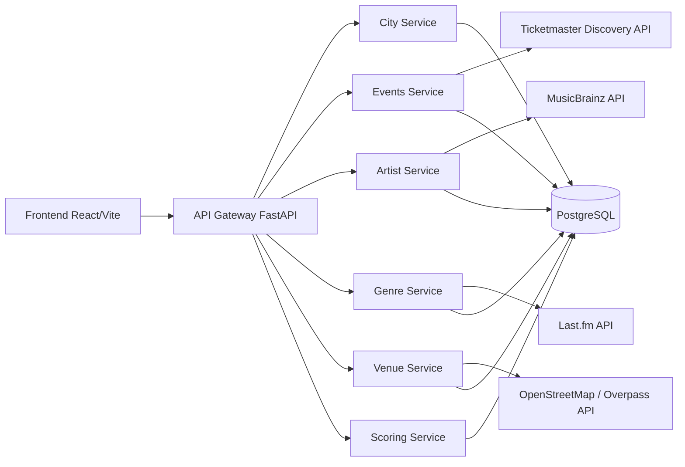

# Architecture — SceneRadar full API mode

SceneRadar uses a lightweight microservice architecture.

## Services

- `events-service`: imports real upcoming music events from Ticketmaster.
- `artist-service`: resolves imported artists through MusicBrainz.
- `genre-service`: imports Last.fm tags and popularity.
- `venue-service`: imports real map venues from Overpass and also exposes Ticketmaster venues saved by events ingestion.
- `scoring-service`: calculates SceneRadar Score.
- `api-gateway`: public REST layer for frontend.
- `frontend`: visual user interface.

No artificial events, artists, tags, venues or city scores are inserted during database initialization.
